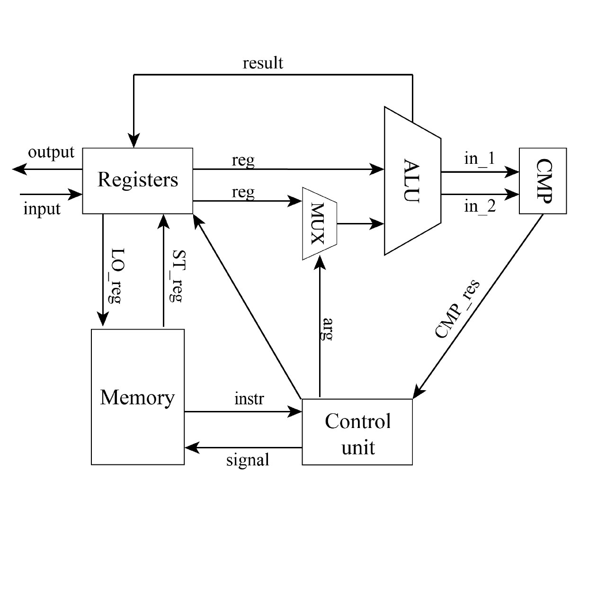
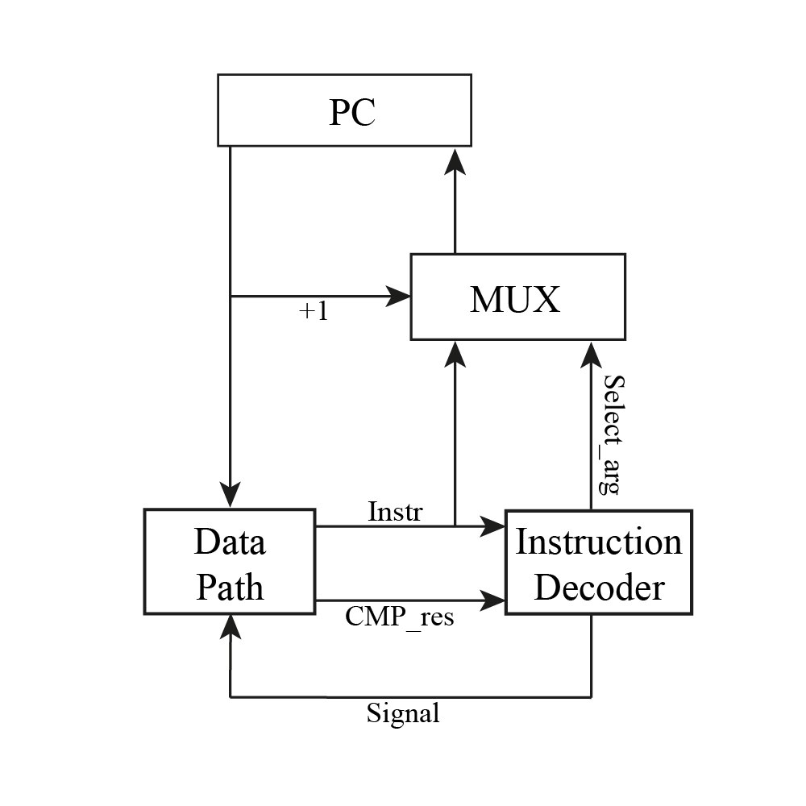

# Lisp. Транслятор и модель

Студент, Мориков Иван Дмитриевич.  
lisp | risc | neum | hw | tick | struct | stream | port | cstr | prob2 | pipeline  
Без усложнения.

## Язык программирования

Любое выражение в скобках (s-expression) возвращает значение. Поддерживаются числовые и строковые литералы. Типизация динамическая, поддерживаются два типа: целые числа и строки

```
<program>      ::= <expression>

<expression>   ::= <atom>

<atom>         ::= <number> | <symbol>

<number>       ::= <integer>

<integer>      ::= <digit>+

<digit>        ::= '0' | '1' | '2' | '3' | '4' | '5' | '6' | '7' | '8' | '9'

<letter>       ::= 'A' | 'B' | ... | 'Z' | 'a' | 'b' | ... | 'z'

<symbol-char>  ::= <letter> | <digit> | '+' | '-' | '*' | '/' | ...

expression = defun_expr 
    | if_expr 
    | while_expr 
    | setq_exp
    | print_char_exp
    | print_string_exp
    | user_defined_function_call_exp
    
defun_expr = "(" "defun" identifier "(" ")" s_expression ")"

if_expr = "(" "if" s_expression s_expression s_expression ")"

while_expr = "(" "while" s_expression s_expression ")"

setq_exp = "(" "setq" s_expression ")"

print_char_exp = "(" "print_char" s_expression ")"

print_string_exp = "(" "print_string" s_expression ")"

```

* `defun` - определение функции.
* `if` - условный оператор, возвращает значение второго выражения, если первое не равно 0, иначе третье.
Обязательно должно быть три выражения - условие, ветка иначе, ветка истины.
* `while` - цикл с предусловием.
* `setq` - инициализация переменной.
* `print_char` - выводит символ с кодом, равным значению выражения, возвращает код символа.
* `print_string` - выводит строку, равную значению выражения, возвращает выведенную строку.
* `print_int` - выводит число
* вызов функции - вызывает код функции.
* идентификаторы - возвращают регистр в которой лежит значение переменной.

## Организация памяти 

Фон Неймановская архитектура.

Память представляет из себя две секции:

```text
    +-----------------+
    |      CODE       |
    |                 |
    |                 |
    |                 |
    +-----------------+
    |   STATIC_DATA   |
    |                 |
    |                 |
    |                 |
    +-----------------+
```

* `STATIC_DATA` - секция, в которой хранятся строки (строковые литералы, а также строки, введенные пользователем)
Строки расположены в том порядке, в котором они встречаются в программe (в этом контексте объявление буффера для
ввода пользователя - тоже строка)

* `CODE` - секция, в которой хранятся инструкции.

## Система команд

* Машинное слово - 32 бита, знаковое.
* Поток управления:
  * Поддерживаются условные и безусловные переходы.
  * В случае, если инструкция не касается переходов, то после нее инкрементится PC.

LD `<register>` `<agr>` - загрузка в регистр данных из кода или с ввода, если есть аргумент `<name>` то загрузка из памяти   
MUL - `<register1>` `<register2>` `<register3>` - умножение в регистр  
DIV - `<register1>` `<register2>` `<register3>` - сложение в регистр  
ADD - `<register1>` `<register2>` `<register3>` - деление в регистр  
SUB - `<register1>` `<register2>` `<register3>` - вычитание в регистр  
ST - `<register1>` `<name>` - сохранение регисттра по имени переменной в память  
INC - `<register1>` - инкремент регистра  
JMP - `<arg>` - безусловный переход по адресу в arg  
CMP - `<register1>` `<arg>` - сравнение двух значений  
JL - `<arg>` - переход, если значение первое значение меньше второго  
JE - `<arg>` - переход, если значение первое значение равно второго  
JG - `<arg>` - переход, если значение первое значение больше второго
HLT - оставновка программы

## Транслятор

реализован в [Транслятор](./translator.py)

Рекурсивно транслирует блоки языка программирования в машинный код

Реализованно 11 регистров:
`<R0>` - вспомогательный для смещение по памяти после инициализации строковой переменной
`<R1-R9>` - штатные для работы с данными
`<R10>` - вспомогательный для хранения результат выполнения внутреннего блока

На вход принимает два файла:
* Файл с программой на языке высокого уровня.
* Файл, в который будет записана программа в машинных словах (в виде JSON)

## Модель процессора

Реализован в [Модель процессора](./machine.py)

### DataPath



### ControlUnit



## Тестирование

В качестве тестов использовано 4 алгоритма:

1. golden/cat.yml - повторяет ввод на выводе
2. golden/cat.yml - считывает имя и выводит приветствие `hello,name`
3. golden/hello.yml - записывает `hello` в переменную и вывод её
4. golden/prob2.yml - проблема 2 Эйлера
5. golden/expression.yml - алгоритм для языка lisp где любое выражение (statement) -- expression

CI:
```yaml
name: Translator Model Python CI

on:
  push:
    branches:
      - main
    paths:
      - ".github/workflows/*"
      - "pythonLab/**"
  pull_request:
    branches:
      - main
    paths:
      - ".github/workflows/*"
      - "pythonLab/**"

defaults:
  run:
    working-directory: ./pythonLab

jobs:
  test:
    runs-on: ubuntu-latest
    steps:
      - name: Checkout code
        uses: actions/checkout@v4
      - name: Set up Python
        uses: actions/setup-python@v4
        with:
          python-version: 3.11
      - name: Install dependencies
        run: |
          python -m pip install --upgrade pip
          pip install poetry
          poetry install
      - name: Run tests and collect coverage
        run: |
          poetry run coverage run -m pytest .
          poetry run coverage report -m
        env:
          CI: true

  lint:
    runs-on: ubuntu-latest
    steps:
      - name: Checkout code
        uses: actions/checkout@v4
      - name: Set up Python
        uses: actions/setup-python@v4
        with:
          python-version: 3.11
      - name: Install dependencies
        run: |
          python -m pip install --upgrade pip
          pip install poetry
          poetry install
      - name: Check code formatting with Ruff
        run: poetry run ruff format --check .
      - name: Run Ruff linters
        run: poetry run ruff check .
```

Журнал работы на примере работы cat:
```common lisp
    (read_char a
    (loop (> a 0) (print_char a) (read_char a)))
```
Машинный код
```json
  {"index": 1, "opcode": "IN", "register": "R1", "name": "a"},
  {"index": 2, "opcode": "LD", "register": "R2", "arg": 0},
  {"index": 3, "opcode": "CMP", "register": "R1", "arg": "R2"},
  {"index": 4, "opcode": "JG", "arg": 8},
  {"index": 5, "opcode": "OUT", "register": "R1"},
  {"index": 6, "opcode": "IN", "register": "R1", "name": "a"},
  {"index": 7, "opcode": "JMP", "arg": 2},
  {"index": 8, "opcode": "HLT"}
```

Лог модели процессора

```text
  DEBUG   machine:simulation    TICK:   0 PC:   0 ALU: 0 	IN R1 a
  DEBUG   machine:signal_input  input: 'I'
  DEBUG   machine:simulation    TICK:   1 PC:   1 ALU: 0 	LD R2
  DEBUG   machine:simulation    TICK:   2 PC:   2 ALU: 0 	CMP R1
  DEBUG   machine:simulation    TICK:   3 PC:   3 ALU: 73 	JG
  DEBUG   machine:simulation    TICK:   4 PC:   4 ALU: 73 	OUT R1
  DEBUG   machine:signal_output output: '' << 'I'
  DEBUG   machine:simulation    TICK:   5 PC:   5 ALU: 73 	IN R1 a
  DEBUG   machine:signal_input  input: 'v'
  DEBUG   machine:simulation    TICK:   6 PC:   6 ALU: 73 	JMP
  DEBUG   machine:simulation    TICK:   7 PC:   1 ALU: 73 	LD R2
  DEBUG   machine:simulation    TICK:   8 PC:   2 ALU: 73 	CMP R1
  DEBUG   machine:simulation    TICK:   9 PC:   3 ALU: 118 	JG
  DEBUG   machine:simulation    TICK:  10 PC:   4 ALU: 118 	OUT R1
  DEBUG   machine:signal_output output: 'I' << 'v'
  DEBUG   machine:simulation    TICK:  11 PC:   5 ALU: 118 	IN R1 a
  DEBUG   machine:signal_input  input: 'a'
  DEBUG   machine:simulation    TICK:  12 PC:   6 ALU: 118 	JMP
  DEBUG   machine:simulation    TICK:  13 PC:   1 ALU: 118 	LD R2
  DEBUG   machine:simulation    TICK:  14 PC:   2 ALU: 118 	CMP R1
  DEBUG   machine:simulation    TICK:  15 PC:   3 ALU: 97 	JG
  DEBUG   machine:simulation    TICK:  16 PC:   4 ALU: 97 	OUT R1
  DEBUG   machine:signal_output output: 'Iv' << 'a'
  DEBUG   machine:simulation    TICK:  17 PC:   5 ALU: 97 	IN R1 a
  DEBUG   machine:signal_input  input: 'n'
  DEBUG   machine:simulation    TICK:  18 PC:   6 ALU: 97 	JMP
  DEBUG   machine:simulation    TICK:  19 PC:   1 ALU: 97 	LD R2
  DEBUG   machine:simulation    TICK:  20 PC:   2 ALU: 97 	CMP R1
  DEBUG   machine:simulation    TICK:  21 PC:   3 ALU: 110 	JG
  DEBUG   machine:simulation    TICK:  22 PC:   4 ALU: 110 	OUT R1
  DEBUG   machine:signal_output output: 'Iva' << 'n'
  DEBUG   machine:simulation    TICK:  23 PC:   5 ALU: 110 	IN R1 a
  DEBUG   machine:signal_input  input: '0'
  DEBUG   machine:simulation    TICK:  24 PC:   6 ALU: 110 	JMP
  DEBUG   machine:simulation    TICK:  25 PC:   1 ALU: 110 	LD R2
  DEBUG   machine:simulation    TICK:  26 PC:   2 ALU: 110 	CMP R1
  DEBUG   machine:simulation    TICK:  27 PC:   3 ALU: 48 	JG
  DEBUG   machine:simulation    TICK:  28 PC:   7 ALU: 48 	HLT
  INFO    machine:simulation    output_buffer: 'Ivan'
```

## Аналитика

```text
| Мориков Иван Дмитриевич | hello_user | 4         | -             | 38         | 123      | 123     lisp | risc | neum | hw | tick | struct | stream | port | cstr | prob2 | pipeline 
| Мориков Иван Дмитриевич | cat        | 2         | -             | 8          | 28       | 28      lisp | risc | neum | hw | tick | struct | stream | port | cstr | prob2 | pipeline
| Мориков Иван Дмитриевич | prob2      | 11        | -             | 24         | 455      | 455     lisp | risc | neum | hw | tick | struct | stream | port | cstr | prob2 | pipeline
```